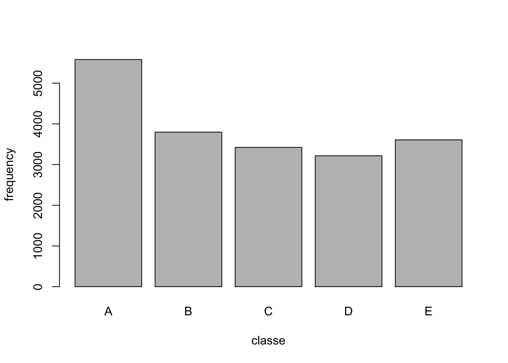
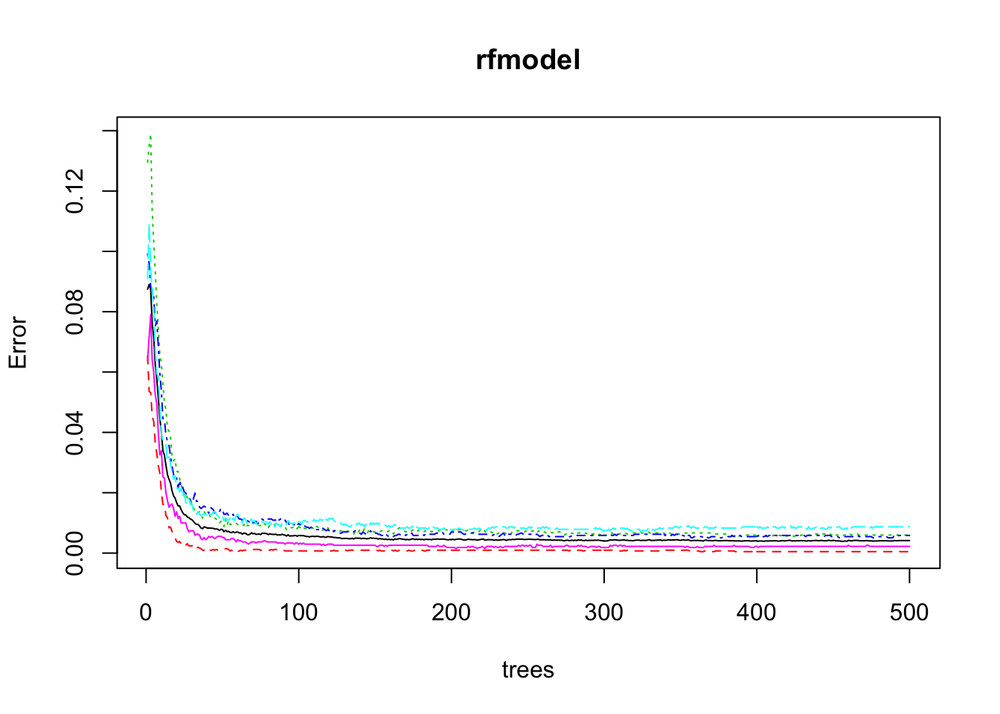

# Machine Learning Course Project
Dmitry Ermakov  
March 14, 2015  

## Description of the problem##
Using devices such as Jawbone Up, Nike FuelBand, and Fitbit it is now possible to collect a large amount of data about personal activity relatively inexpensively. These type of devices are part of the quantified self movement - a group of enthusiasts who take measurements about themselves regularly to improve their health, to find patterns in their behaviour, or because they are tech geeks. One thing that people regularly do is quantify how much of a particular activity they do, but they rarely quantify how well they do it.

##The goal of this project##
The goal will be to use data from accelerometers on the belt, forearm, arm, and dumbell of 6 participants. They were asked to perform barbell lifts correctly and incorrectly in 5 different ways. 
More information is available from the website here: http://groupware.les.inf.puc-rio.br/har (see the section on the Weight Lifting Exercise Dataset).

## Data Sources
The training data for this project are available here: 
https://d396qusza40orc.cloudfront.net/predmachlearn/pml-training.csv
The test data are available here: 
https://d396qusza40orc.cloudfront.net/predmachlearn/pml-testing.csv
The data for this project come from this source: http://groupware.les.inf.puc-rio.br/har. If you use the document you create for this class for any purpose please cite them as they have been very generous in allowing their data to be used for this kind of assignment.

##Getting the data
 All data files were downloaded from previously mentioned sources to working directory. Loading datasets.

```r
df <- read.csv("pml-training.csv", na.strings=c("NA","#DIV/0!",""))
dim(df)
```

```
## [1] 19622   160
```

```r
finTest <- read.csv("pml-testing.csv", na.strings=c("NA","#DIV/0!",""))
dim(finTest)
```

```
## [1]  20 160
```
##Cleaning up the data##
Remove columns without data and remove first 7 columnes not related to the rpoject.

```r
df <-df[, colSums(is.na(df)) == 0]
df <- df[,-c(1:7)]
dim(df)
```

```
## [1] 19622    53
```

After cleaning we have the data set with 19622 obs and 53 variables.
Let's take a look at the data distribution by variable **classe**

```r
plot(df$classe, xlab="classe", ylab='frequency')
```

 

#Splitting the data into trainig and testing data sets#
We divide the main data into a training set of 75% and a testing set of 25%.

```r
library(caret)
library(randomForest)
TrainIn <- createDataPartition(df$classe, p=0.75, list = FALSE)
traindf <- df[TrainIn,]
testdf <- df[-TrainIn,]
```

## Building the model
We use RandomForest method to build model for classification and regression. This method reduces nonlinear features and overfitting.

```r
library(randomForest)
set.seed(333)
rfmodel <- randomForest(classe ~. , data=traindf, importance=TRUE)
print(rfmodel)
```

```
## 
## Call:
##  randomForest(formula = classe ~ ., data = traindf, importance = TRUE) 
##                Type of random forest: classification
##                      Number of trees: 500
## No. of variables tried at each split: 7
## 
##         OOB estimate of  error rate: 0.46%
## Confusion matrix:
##      A    B    C    D    E  class.error
## A 4184    1    0    0    0 0.0002389486
## B   13 2828    7    0    0 0.0070224719
## C    0   13 2551    3    0 0.0062329568
## D    0    0   19 2390    3 0.0091210614
## E    0    0    2    6 2698 0.0029563932
```
The out-of-bag(OOB) error rate 0.41% by the model is good to estimate **out of sample error rate**. 

## Cross Valodation and Out of Sample Error rate
Cross-validating by using the model with the test data set and provided sample tasting data set to produce

```r
rfprediction <- predict(rfmodel, testdf)
confusionMatrix(rfprediction, testdf$classe)
```

```
## Confusion Matrix and Statistics
## 
##           Reference
## Prediction    A    B    C    D    E
##          A 1393    0    0    0    0
##          B    2  948    2    0    0
##          C    0    1  852    9    1
##          D    0    0    1  793    3
##          E    0    0    0    2  897
## 
## Overall Statistics
##                                           
##                Accuracy : 0.9957          
##                  95% CI : (0.9935, 0.9973)
##     No Information Rate : 0.2845          
##     P-Value [Acc > NIR] : < 2.2e-16       
##                                           
##                   Kappa : 0.9946          
##  Mcnemar's Test P-Value : NA              
## 
## Statistics by Class:
## 
##                      Class: A Class: B Class: C Class: D Class: E
## Sensitivity            0.9986   0.9989   0.9965   0.9863   0.9956
## Specificity            1.0000   0.9990   0.9973   0.9990   0.9995
## Pos Pred Value         1.0000   0.9958   0.9873   0.9950   0.9978
## Neg Pred Value         0.9994   0.9997   0.9993   0.9973   0.9990
## Prevalence             0.2845   0.1935   0.1743   0.1639   0.1837
## Detection Rate         0.2841   0.1933   0.1737   0.1617   0.1829
## Detection Prevalence   0.2841   0.1941   0.1760   0.1625   0.1833
## Balanced Accuracy      0.9993   0.9990   0.9969   0.9927   0.9975
```
We get the great accuracy of 99.55 which shows **out of sample error rate** is **0.45%**. The RandomForest is a good enough method and we don't need to test any other.

```r
plot(rfmodel)
```

 

## Importance of variables 
The first 5 most important variables:

```r
head(rfmodel$importance, n = 5)
```

```
##                           A           B          C          D          E
## roll_belt        0.07741336 0.099154518 0.12406535 0.13338008 0.19180665
## pitch_belt       0.07485308 0.126817477 0.10718871 0.11169901 0.03680750
## yaw_belt         0.12521531 0.106569942 0.13183571 0.16724022 0.07307713
## total_accel_belt 0.01763939 0.021684957 0.02502614 0.02341888 0.02044846
## gyros_belt_x     0.01684831 0.008920119 0.02028611 0.01221104 0.00386995
##                  MeanDecreaseAccuracy MeanDecreaseGini
## roll_belt                  0.11994129        918.71122
## pitch_belt                 0.08957910        523.88624
## yaw_belt                   0.12003405        700.23894
## total_accel_belt           0.02117577        144.34749
## gyros_belt_x               0.01277296         71.99595
```

## Predict answers for 20 samples and generate files for sumbmitting. 
We use provided test data set.

```r
result <- predict(rfmodel, finTest)
print(result)
```

```
##  1  2  3  4  5  6  7  8  9 10 11 12 13 14 15 16 17 18 19 20 
##  B  A  B  A  A  E  D  B  A  A  B  C  B  A  E  E  A  B  B  B 
## Levels: A B C D E
```

```r
#result <- as.character(result)
#pml_write_files(result)
```


